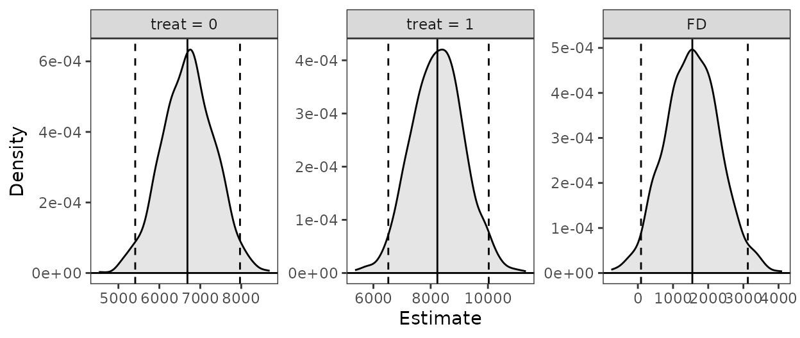
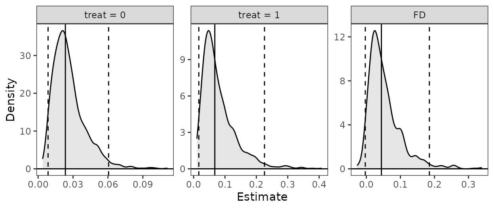
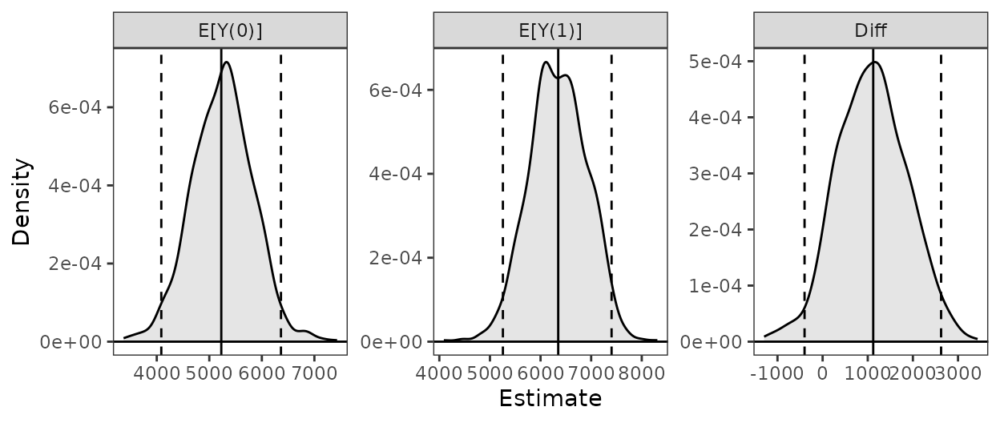
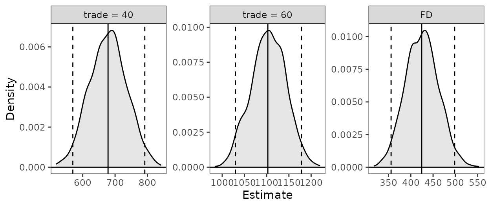

# Translating Zelig to clarify

## Introduction

In this document, we demonstrate some common uses of *Zelig* (Imai et
al. 2008) and how the same tasks can be performed using *clarify*. We’ll
include examples for computing predictions at representative values
(i.e., `setx()` and [`sim()`](../reference/sim.md) in *Zelig*), the
rare-events logit model, estimating the average treatment effect (ATT)
after matching, and combining estimates after multiple imputation.

The usual workflow in *Zelig* is to fit a model using `zelig()`, specify
quantities of interest to simulate using `setx()` on the `zelig()`
output, and then simulate those quantities using
[`sim()`](../reference/sim.md). *clarify* uses a similar approach,
except that the model is fit outside *clarify* using functions in a
different R package. In addition, *clarify*’s
[`sim_apply()`](../reference/sim_apply.md) allows for the computation of
any arbitrary quantity of interest. Unlike *Zelig*, *clarify* follows
the recommendations of Rainey (2023) to use the estimates computed from
the original model coefficients rather than the average of the simulated
draws. We’ll demonstrate how to replicate a standard *Zelig* analysis
using *clarify* step-by-step. Because simulation-based inference
involves randomness and some of the algorithms may not perfectly align,
one shouldn’t expect results to be identical, though in most cases, they
should be similar.

``` r

## library("Zelig")
library("clarify")
set.seed(100)
```

Note that both *Zelig* and *clarify* have a function called
“[`sim()`](../reference/sim.md)”, so we will always make it clear which
package’s [`sim()`](../reference/sim.md) is being used.

## Predictions at representative values

Here we’ll use the `lalonde` dataset in *MatchIt* and fit a linear model
for `re78` as a function of the treatment `treat` and covariates.

``` r

data("lalonde", package = "MatchIt")
```

We’ll be interested in the predicted values of the outcome for a typical
unit at each level of treatment and their first difference.

### *Zelig* workflow

In *Zelig*, we fit the model using `zelig()`:

``` r

fit <- zelig(re78 ~ treat + age + educ + married + race +
               nodegree + re74 + re75, data = lalonde,
             model = "ls", cite = FALSE)
```

Next, we use `setx()` and `setx1()` to set our values of `treat`:

``` r

fit <- setx(fit, treat = 0)
fit <- setx1(fit, treat = 1)
```

Next we simulate the values using [`sim()`](../reference/sim.md):

``` r

fit <- Zelig::sim(fit)
```

Finally, we can print and plot the predicted values and first
differences:

``` r

fit
```

``` r

plot(fit)
```

### *clarify* workflow

In *clarify*, we fit the model using functions outside *clarify*, like
[`stats::lm()`](https://rdrr.io/r/stats/lm.html)or
[`fixest::feols()`](https://lrberge.github.io/fixest/reference/feols.html).

``` r

fit <- lm(re78 ~ treat + age + educ + married + race +
            nodegree + re74 + re75, data = lalonde)
```

Next, we simulate the model coefficients using
[`clarify::sim()`](../reference/sim.md):

``` r

s <- clarify::sim(fit)
```

Next, we use [`sim_setx()`](../reference/sim_setx.md) to set our values
of the predictors:

``` r

est <- sim_setx(s, x = list(treat = 0), x1 = list(treat = 1))
```

Finally, we can summarize and plot the predicted values:

``` r

summary(est)
#>           Estimate   2.5 %  97.5 %
#> treat = 0   6686.0  5410.3  7970.1
#> treat = 1   8234.3  6521.0 10027.9
#> FD          1548.2    89.7  3126.5

plot(est)
```



## Rare-events logit

*Zelig* uses a special method for logistic regression with rare events
as described in King and Zeng (2001). This is the primary implementation
of the method in R. However, newer methods have been developed that
perform similarly to or better than the method of King and Zeng (Puhr et
al. 2017) and are implemented in R packages that are compatible with
*clarify*, such as *logistf* and *brglm2*.

Here, we’ll use the `lalonde` dataset with a constructed rare outcome
variable to demonstrate how to perform a rare events logistic regression
in *Zelig* and in *clarify*.

``` r

data("lalonde", package = "MatchIt")

#Rare outcome: 1978 earnings over $20k; ~6% prevalence
lalonde$re78_20k <- lalonde$re78 >= 20000
```

### *Zelig* workflow

In *Zelig*, we fit a rare events logistic model using `zelig()` with
`model = "relogit"`.

``` r

fit <- zelig(re78_20k ~ treat + age + educ + married + race +
               nodegree + re74 + re75, data = lalonde,
             model = "relogit", cite = FALSE)

fit
```

We can compute predicted values at representative values using `setx()`
and `Zelig::sim()` as above.

``` r

fit <- setx(fit, treat = 0)
fit <- setx1(fit, treat = 1)

fit <- Zelig::sim(fit)

fit
```

``` r

plot(fit)
```

### *clarify* workflow

Here, we’ll use `logistf::logistif()` with `flic = TRUE`, which performs
a variation on Firth’s logistic regression with a correction for bias in
the intercept (Puhr et al. 2017).

``` r

fit <- logistf::logistf(re78_20k ~ treat + age + educ + married + race +
                          nodegree + re74 + re75, data = lalonde,
                        flic = TRUE)

summary(fit)
#> logistf::logistf(formula = re78_20k ~ treat + age + educ + married + 
#>     race + nodegree + re74 + re75, data = lalonde, flic = TRUE)
#> 
#> Model fitted by Penalized ML
#> Coefficients:
#>                      coef     se(coef)    lower 0.95    upper 0.95      Chisq
#> (Intercept) -9.313465e+00 2.036981e+00 -1.330595e+01 -5.3209820512 24.4427501
#> treat        1.106769e+00 6.165332e-01 -1.029333e-01  2.3139987641  3.2185792
#> age          4.144350e-02 2.147498e-02 -8.432745e-04  0.0825427498  3.6937075
#> educ         2.936673e-01 1.283624e-01  4.612509e-02  0.5477908006  5.4633187
#> married      2.909164e-01 4.769332e-01 -6.309243e-01  1.2240602694  0.3844676
#> racehispan   1.056388e+00 7.276772e-01 -4.150796e-01  2.4305568008  2.0440063
#> racewhite    5.431919e-01 6.160352e-01 -6.255328e-01  1.7838676828  0.8008622
#> nodegree     2.868319e-01 5.852738e-01 -8.531608e-01  1.4243907533  0.2462839
#> re74         1.108995e-04 2.821452e-05  5.775266e-05  0.0001664918 17.0427331
#> re75         4.457916e-05 4.720736e-05 -4.706292e-05  0.0001334568  0.9472092
#>                        p method
#> (Intercept) 7.655103e-07      1
#> treat       7.280680e-02      2
#> age         5.461808e-02      2
#> educ        1.941973e-02      2
#> married     5.352219e-01      2
#> racehispan  1.528067e-01      2
#> racewhite   3.708357e-01      2
#> nodegree    6.197040e-01      2
#> re74        3.654797e-05      2
#> re75        3.304307e-01      2
#> 
#> Method: 1-Wald, 2-Profile penalized log-likelihood, 3-None
#> 
#> Likelihood ratio test=65.80085 on 9 df, p=1.007627e-10, n=614
#> Wald test = 179.4243 on 9 df, p = 0
```

We can compute predictions at representative values using
[`clarify::sim()`](../reference/sim.md) and
[`sim_setx()`](../reference/sim_setx.md).

``` r

s <- clarify::sim(fit)

est <- sim_setx(s, x = list(treat = 0), x1 = list(treat = 1))

summary(est)
#>           Estimate    2.5 %   97.5 %
#> treat = 0  0.02341  0.00853  0.06054
#> treat = 1  0.06760  0.01661  0.22588
#> FD         0.04419 -0.00315  0.18509
```

``` r

plot(est)
```



## Estimating the ATT after matching

Here we’ll use the `lalonde` dataset and perform propensity score
matching and then fit a linear model for `re78` as a function of the
treatment `treat`, the covariates, and their interaction. From this
model, we’ll compute the ATT of `treat` using *Zelig* and *clarify*.

``` r

data("lalonde", package = "MatchIt")

m.out <- MatchIt::matchit(treat ~ age + educ + married + race +
                            nodegree + re74 + re75, data = lalonde,
                          method = "nearest")
```

### *Zelig* workflow

In *Zelig*, we fit the model using `zelig()` directly on the `<matchit>`
object:

``` r

fit <- zelig(re78 ~ treat * (age + educ + married + race +
                               nodegree + re74 + re75),
             data = m.out, model = "ls", cite = FALSE)
```

Next, we use `ATT()` to request the ATT of `treat` and simulate the
values:

``` r

fit <- ATT(fit, "treat")
```

``` r

fit
```

``` r

plot(fit)
```

### *clarify* workflow

In *clarify*, we need to extract the matched dataset and fit a model
outside *clarify* using another package.

``` r

m.data <- MatchIt::match.data(m.out)

fit <- lm(re78 ~ treat * (age + educ + married + race +
                            nodegree + re74 + re75),
          data = m.data)
```

Next, we simulate the model coefficients using
[`clarify::sim()`](../reference/sim.md). Because we performed pair
matching, we will request a cluster-robust standard error:

``` r

s <- clarify::sim(fit, vcov = ~subclass)
```

Next, we use [`sim_ame()`](../reference/sim_ame.md) to request the
average marginal effect of `treat` within the subset of treated units:

``` r

est <- sim_ame(s, var = "treat", subset = treat == 1,
               contrast = "diff")
```

Finally, we can summarize and plot the ATT:

``` r

summary(est)
#>         Estimate 2.5 % 97.5 %
#> E[Y(0)]     5228  4086   6364
#> E[Y(1)]     6349  5256   7404
#> Diff        1121  -400   2625

plot(est)
```



## Combining results after multiple imputation

Here we’ll use the `africa` dataset in *Amelia* to demonstrate combining
estimates after multiple imputation. This analysis is also demonstrated
using *clarify* at the end of
[`vignette("clarify")`](../articles/clarify.md).

``` r

library(Amelia)
data("africa", package = "Amelia")
```

First we multiply impute the data using
[`amelia()`](https://rdrr.io/pkg/Amelia/man/amelia.html) using the
specification in the *Amelia* documentation.

``` r

# Multiple imputation
a.out <- amelia(x = africa, m = 10, cs = "country",
                ts = "year", logs = "gdp_pc", p2s = 0)
```

### *Zelig* workflow

With *Zelig*, we can supply the
[`amelia()`](https://rdrr.io/pkg/Amelia/man/amelia.html) output object
directly to the `data` argument of `zelig()` to fit a model in each
imputed dataset:

``` r

fit <- zelig(gdp_pc ~ infl * trade, data = a.out,
             model = "ls", cite = FALSE)
```

Summarizing the coefficient estimates after the simulation can be done
using [`summary()`](https://rdrr.io/r/base/summary.html):

``` r

summary(fit)
```

We can use `Zelig::sim()` and `setx()` to compute predictions at
specified values of the predictors:

``` r

fit <- setx(fit, infl = 0, trade = 40)
fit <- setx1(fit, infl = 0, trade = 60)

fit <- Zelig::sim(fit)
```

*Zelig* does not allow you to combine predicted values across
imputations.

``` r

fit
```

``` r

plot(fit)
```

### *clarify* workflow

*clarify* does not combine coefficients, unlike `zelig()`; instead, the
models should be fit using `Amelia::with()`. To view the combined
coefficient estimates, use
[`Amelia::mi.combine()`](https://rdrr.io/pkg/Amelia/man/mi.combine.html).

``` r

#Use Amelia functions to model and combine coefficients
fits <- with(a.out, lm(gdp_pc ~ infl * trade))

mi.combine(fits)
#> # A tibble: 4 × 8
#>   term        estimate std.error statistic  p.value     df      r miss.info
#>   <chr>          <dbl>     <dbl>     <dbl>    <dbl>  <dbl>  <dbl>     <dbl>
#> 1 (Intercept) -171.      118.        -1.44 1.85e+ 0 12575. 0.0275    0.0269
#> 2 infl          12.2       9.42       1.29 1.97e- 1 72291. 0.0113    0.0112
#> 3 trade         21.2       1.83      11.6  4.85e-31 19660. 0.0219    0.0215
#> 4 infl:trade    -0.289     0.141     -2.05 1.96e+ 0 83194. 0.0105    0.0104
```

Derived quantities can be computed using
[`clarify::misim()`](../reference/misim.md) and
[`sim_apply()`](../reference/sim_apply.md) or its wrappers on the
[`with()`](https://rdrr.io/r/base/with.html) output, which is a list of
regression model fits:

``` r

#Simulate coefficients, 100 in each of 10 imputations
s <- misim(fits, n = 100)

#Compute predictions at specified values
est <- sim_setx(s, x = list(infl = 0, trade = 40),
                x1 = list(infl = 0, trade = 60))

summary(est)
#>            Estimate 2.5 % 97.5 %
#> trade = 40      678   570    792
#> trade = 60     1103  1030   1178
#> FD              424   356    498

plot(est)
```



## References

Imai, Kosuke, Gary King, and Olivia Lau. 2008. “Toward a Common
Framework for Statistical Analysis and Development.” *Journal of
Computational and Graphical Statistics* 17 (4): 892–913.
<https://doi.org/10.1198/106186008X384898>.

King, Gary, and Langche Zeng. 2001. “Logistic Regression in Rare Events
Data.” *Political Analysis* 9 (2): 137–63.
<https://doi.org/10.1093/oxfordjournals.pan.a004868>.

Puhr, Rainer, Georg Heinze, Mariana Nold, Lara Lusa, and Angelika
Geroldinger. 2017. “Firth’s Logistic Regression with Rare Events:
Accurate Effect Estimates and Predictions?” *Statistics in Medicine* 36
(14): 2302–17. <https://doi.org/10.1002/sim.7273>.

Rainey, Carlisle. 2023. “A Careful Consideration of CLARIFY:
Simulation-Induced Bias in Point Estimates of Quantities of Interest.”
*Political Science Research and Methods*, 1–10.
<https://doi.org/10.1017/psrm.2023.8>.
